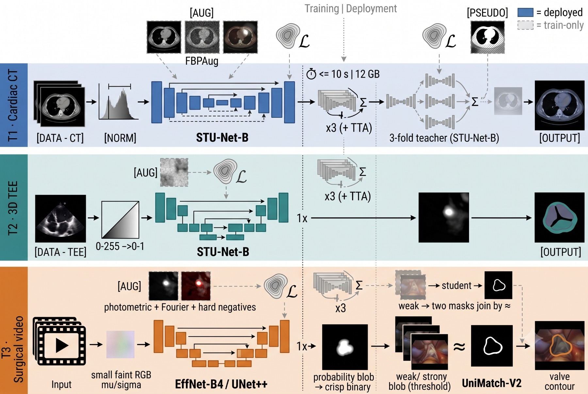
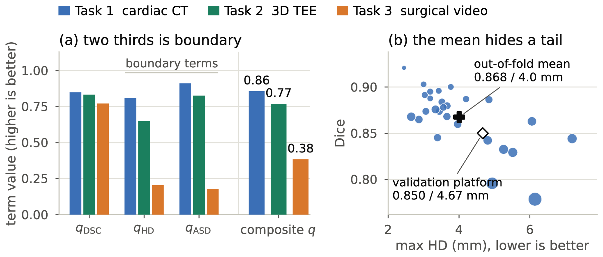

<h1 align="center">
<strong>BEAT: Boundary-aware Efficient Anatomy-Transfer for Multimodal Mitral Valve Segmentation</strong>
</h1>

<div align="center">

<a href="https://git.io/typing-svg">

</a>

[](https://openreview.net/forum?id=yRMVmTyr3S)
[](https://www.codabench.org/competitions/15662/)
[](https://openreview.net/forum?id=yRMVmTyr3S)
[](https://huggingface.co/adidukre/BEAT-MVAA)
[](LICENSE)
[](https://visitorbadge.io/status?path=https%3A%2F%2Fgithub.com%2Fadinathdukre%2FBEAT-MVAA)

<h3>📄 <a href="https://openreview.net/forum?id=yRMVmTyr3S">Paper</a> &nbsp;|&nbsp; 🤗 <a href="https://huggingface.co/adidukre/BEAT-MVAA">Weights</a> &nbsp;|&nbsp; 🧠 <a href="#-method">Method</a> &nbsp;|&nbsp; ⚡ <a href="#-inference">Inference</a></h3>

**Atharva Atul Rege, [Adinath Madhavrao Dukre](https://github.com/adinathdukre), Sarth Santosh Shah, Imran Razzak**


</div>

## 🔥 News
- **[30 Sep 2026]** 🚀 Code, Docker image and weights for all three MVAA tasks are released.
- **[03 Aug 2026]** 🎉 Our BEAT paper is **accepted** at the 1st MICCAI Workshop on Medical World Models (MWM 2026) and published on [OpenReview](https://openreview.net/forum?id=yRMVmTyr3S).

## Overview
Official code for **BEAT**, our solution to the **MICCAI 2026 MVAA challenge** (Mitral Valve Multimodal Anatomical Analysis). One framework segments the mitral valve in three modalities:

| Task | Modality | Supervision | Model |
|---|---|---|---|
| **T1** | Cardiac CT (3D) | Semi-supervised | STU-Net-L / STU-Net-B ensemble |
| **T2** | 3D TEE ultrasound | Fully supervised | STU-Net-B, 3 seeds |
| **T3** | Surgical video frames (2D) | Semi-supervised | UNet++ / EfficientNet-B4 cascade |

<p align="center">

<br/>
<em><b>Fig. 1.</b> The BEAT recipe and its three instantiations. A pretrained backbone is supervised with train-only boundary losses under augmentation matched to each modality; dashed components are used only during training.</em>
</p>

## 📖 Contents
- [🧠 Method](#-method)
- [🏆 Results](#-results-validation)
- [⛏️ Installation](#️-installation)
- [🧩 Checkpoints](#-checkpoints)
- [🗂️ Data](#️-data)
- [⚡ Inference](#-inference)
- [🏋️ Training](#️-training)
- [📁 Repository Structure](#-repository-structure)
- [📝 Citation](#-citation)
- [📚 Acknowledgments](#-acknowledgments)
- [📨 Contact](#-contact)
- [📜 License](#-license)

## 🧠 Method

- **T1 (CT).** STU-Net (pretrained on TotalSegmentator) is fine-tuned with CT intensities clipped to
  the foreground window used during STU-Net pretraining (`[-99, 646]` HU). Three fold teachers label
  the unlabeled CT pool. Their pseudo-labels are confidence-gated (stricter near the boundary), and the
  students are retrained on labeled plus pseudo-labeled data. Training uses DiceCE + boundary +
  skeleton-recall + cbDice + edge-consistency losses. Inference averages 8 members with 8-way flip
  TTA, then keeps the largest component and applies morphological closing.
- **T2 (3D TEE).** STU-Net-B with per-case intensity normalization and a compact loss: DiceCE,
  Generalized Surface Loss, clDice and Skeleton Recall. Inference averages 3 seeds over two sampling
  geometries with 8-way flip TTA, then applies per-class connected-component filtering and closing.
- **T3 (surgical video).** UNet++ with an ImageNet EfficientNet-B4 encoder, trained with heavy
  photometric augmentation, synthetic surgical corruptions, and UniMatch-V2 weak-to-strong consistency
  on the unlabeled video pool. Inference is a three-model threshold cascade with no TTA.

> [!NOTE]
> All boundary and topology terms are training-only losses, so the deployed networks are plain
> segmentation CNNs.

## 🏆 Results (validation)

<div align="center">

| Task | Dice ↑ | max HD (mm) ↓ | ASD (mm) ↓ |
|---|:---:|:---:|:---:|
| T1 cardiac CT | 0.850 | 4.67 | 0.29 |
| T2 3D TEE | 0.833 | 10.81 | 0.63 |
| T3 surgical video | 0.772 | 77.90 | 13.91 |

</div>

<p align="center">

<br/>
<em><b>Fig. 2.</b> (a) The validation results split into the terms of the challenge score. (b) Task 1 per-case out-of-fold Dice against max HD, with marker area growing with ASD.</em>
</p>

## ⛏️ Installation

```bash
git clone https://github.com/adinathdukre/BEAT-MVAA.git
cd BEAT-MVAA
conda create -n beat python=3.10 -y
conda activate beat
pip install -r requirements.txt
pip install -e .
```

## 🧩 Checkpoints

Download the trained weights into `weights/`:

```bash
pip install -U "huggingface_hub[cli]"
huggingface-cli download adidukre/BEAT-MVAA --local-dir weights
```

```text
weights/
├── task1/  L_f0.pt L_f1.pt L_f2.pt L_all.pt L_s2026.pt  (STU-Net-L)
│           B_f0.pt B_f1.pt B_f2.pt                      (STU-Net-B)
├── task2/  s42.pt s43.pt s44.pt                         (STU-Net-B)
└── task3/  s42.pt s44.pt guard_e37.pt                   (UNet++ / EfficientNet-B4)
```

T1 members are dispatched by filename prefix (`L_*` for STU-Net-L, `B_*` for STU-Net-B). Every
`.pt` file in a task folder becomes part of that task's ensemble.

> [!IMPORTANT]
> To **train** from scratch you also need the STU-Net base weights (`base_ep4k.model`,
`large_ep4k.model`, `huge_ep4k.model`) from [uni-medical/STU-Net](https://github.com/uni-medical/STU-Net),
> placed under `$MVAA_CKPT_DIR/STU-Net/`.

## 🗂️ Data

Get the MVAA dataset from the challenge organizers
([Codabench 15662](https://www.codabench.org/competitions/15662/)); it is not redistributed here.

```text
/path/to/MVAA/
├── images/                          # unlabeled surgical video pool (T3)
└── reference_data/
    ├── t1_ct/{train,val}/{images,labels}
    ├── t2_tee/{train,val}/{images,labels}
    └── t3_vid/{train,val}/{images,labels}
```

```bash
export MVAA_DATA_ROOT=/path/to/MVAA
export MVAA_RUNS_DIR=/path/to/runs          # training outputs
export MVAA_CKPT_DIR=/path/to/pretrained    # STU-Net base weights (training only)
```

> [!TIP]
> Any config value can be overridden from the command line as `key=value` (OmegaConf dotlist).

## ⚡ Inference

The entry point runs all three tasks and writes the official submission layout
(`t1_ct/`, `t2_tee/`, `t3_vid/`, each with a `task{N}_predictions.json`).

```bash
MVAA_APP_DIR=$PWD \
MVAA_WEIGHTS_DIR=$PWD/weights \
MVAA_INPUT_DIR=/path/to/input \
MVAA_OUTPUT_DIR=/path/to/output \
python scripts/run_inference.py
```

The input folder uses `t1_ct/images/*.nii.gz`, `t2_tee/images/*-US.nii.gz` and
`t3_vid/images/**/*.png`, or an optional `test_cases.json` manifest. Set `MVAA_TASKS=1,3` to run only
some tasks.

### 🐳 Docker

```bash
docker build -t beat-mvaa .
docker run --rm --gpus all --network none \
  -v /path/to/input:/input:ro -v /path/to/output:/output \
  beat-mvaa
```

### Single-model prediction on a labeled split

```bash
python -m task1.predict --ckpt weights/task1/B_f0.pt --split val --out /path/to/pred_t1 model.stunet_size=B
python -m task2.predict --ckpt weights/task2/s42.pt --split val --out /path/to/pred_t2
python -m task3.predict --ckpt weights/task3/s42.pt --split val --out /path/to/pred_t3 model.encoder_weights=null
```

## 🏋️ Training

T1 and T2 use `torchrun` (DDP/FSDP). T3 trains on one GPU.

<details open>
<summary><strong>Task 1 (CT, semi-supervised)</strong></summary>


The teacher distills features from CT-FM, which needs `pip install lighter-zoo` (weights are fetched from
Hugging Face). Pass `teacher.distill_ct=false` to skip it.

```bash
# 1. fold teachers (repeat for fold=0,1,2)
torchrun --standalone --nproc_per_node=4 -m task1.train_teacher --exp teacher_f0 \
  data.n_folds=3 data.fold=0

# 2. ensemble pseudo-labels on the unlabeled CT pool
python -m task1.make_pseudolabels \
  --ckpt $MVAA_RUNS_DIR/task1/teacher_f0_*/checkpoints/teacher_best.pt \
  --ckpt $MVAA_RUNS_DIR/task1/teacher_f1_*/checkpoints/teacher_best.pt \
  --ckpt $MVAA_RUNS_DIR/task1/teacher_f2_*/checkpoints/teacher_best.pt \
  --out_dir $MVAA_RUNS_DIR/pseudolabels/t1_ct_r2_hq500

# 3. students (STU-Net-L shown; use model.stunet_size=B for the B members)
torchrun --standalone --nproc_per_node=4 -m task1.train_student --exp L_f0 \
  model.stunet_size=L model.stunet_ckpt=$MVAA_CKPT_DIR/STU-Net/large_ep4k.model \
  data.n_folds=3 data.fold=0 train.batch_size=1
```

</details>

<details>
<summary><strong>Task 2 (3D TEE)</strong></summary>


```bash
torchrun --standalone --nproc_per_node=4 -m task2.train --exp s42 seed=42
```

</details>

<details>
<summary><strong>Task 3 (surgical video)</strong></summary>


```bash
python -m task3.train_student --exp s42 seed=42
python -m task3.train_student --exp guard_e37 seed=42 train.epochs=40 data.holdout_video=675A
```

</details>

Each run writes `config.yaml`, logs and checkpoints to `$MVAA_RUNS_DIR/<task>/<exp>_<git-sha>/`. Copy the selected `best.pt` files into `weights/<task>/` to deploy.

## 📁 Repository Structure

```text
BEAT-MVAA/
├── common/     # losses, metrics, post-processing, sliding window, I/O, model registry
├── task1/      # CT: teacher, pseudo-labels, student, predict
├── task2/      # 3D TEE: train, predict
├── task3/      # video: semi-supervised student, predict
├── scripts/    # ensemble inference (run_inference.py) and per-task ensemble predictors
└── configs/    # OmegaConf YAML configs (paths, common, task1-3)
```

## 📝 Citation

If you find our paper and code useful in your research, please cite:

```bibtex
@inproceedings{regebeat,
  title={BEAT: Boundary-aware Efficient Anatomy-Transfer for Multimodal Mitral Valve Segmentation},
  author={Rege, Atharva Atul and Dukre, Adinath Madhavrao and Shah, Sarth Santosh and Razzak, Imran},
  booktitle={The 1st MICCAI Workshop on Medical World Models},
  year={2026},
  url={https://openreview.net/forum?id=yRMVmTyr3S}
}
```

## 📚 Acknowledgments

This work builds on [STU-Net](https://github.com/uni-medical/STU-Net) / [MedIM](https://github.com/uni-medical/MedIM),
[segmentation-models-pytorch](https://github.com/qubvel-org/segmentation_models.pytorch),
[MONAI](https://github.com/Project-MONAI/MONAI) and
[UniMatch-V2](https://github.com/LiheYoung/UniMatch-V2). We thank the MVAA 2026 organizers for the data and the evaluation.

## 📨 Contact
For questions or collaboration, please open an [issue](https://github.com/adinathdukre/BEAT-MVAA/issues) or reach out to [Adinath Madhavrao Dukre](https://github.com/adinathdukre).

## 📜 License

Code is released under the MIT License. The MVAA data and third-party pretrained weights keep their own licenses.

> [!IMPORTANT]
> BEAT is intended for research only. It is not approved for clinical use and must not inform any diagnostic or treatment decision.
